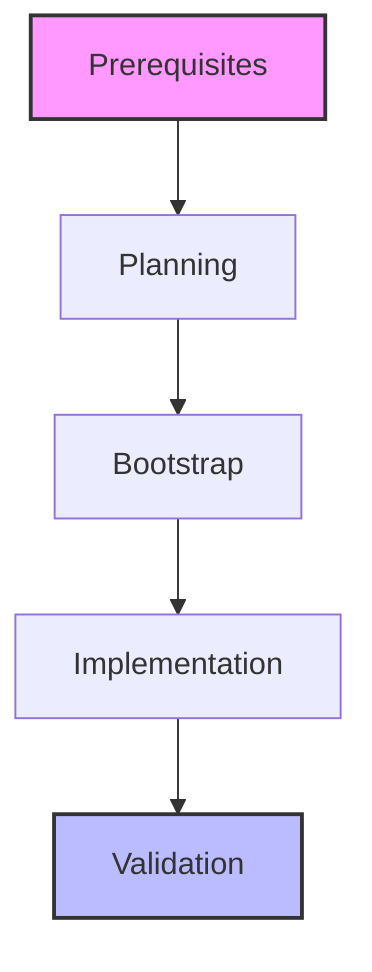

# Azure Landing Zone Implementation Journey

## Project Overview
This repository documents my implementation of an Azure Landing Zone using Microsoft's ALZ Accelerator approach in a greenfield environment. The implementation demonstrates best practices and real-world considerations while avoiding any sensitive data.

## About This Documentation
This documentation is AI-assisted, primarily generated through collaboration with Anthropic's Claude-3.5-Sonnet via the Cursor IDE. While the content structure and technical guidance comes from Microsoft's official ALZ documentation, I'm using AI to help articulate and document my learning journey effectively.

### Purpose
- Document my hands-on learning of Azure Landing Zone implementation in a greenfield environment
- Create a practical portfolio piece demonstrating cloud architecture understanding
- Bridge the gap between theoretical knowledge and practical implementation
- Showcase my approach to enterprise-scale Azure solutions

### Learning Approach
I'm working through this implementation as part of my professional development, combining:
- Study of Microsoft's ALZ documentation and best practices
- Practical implementation in a demo environment
- Documentation of the process and lessons learned
- Portfolio development to support my career progression

## Implementation Phases

[Prerequisites →](./prerequisites.md)
[Planning Decisions →](./planning.md)
[Implementation Steps →](./implementation/index.md) 