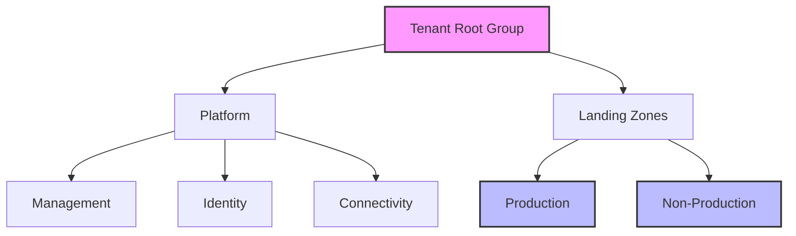
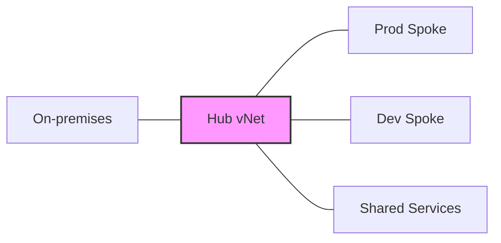

# Planning Decisions

## Management Group Structure

## Network Architecture

## Key Decisions
### 1. Networking Approach
- Hub and Spoke topology
- Azure Virtual WAN consideration
- DNS configuration
- Network security groups

### 2. Security Controls
- Policy assignments
- RBAC model
- Monitoring requirements

### 3. Governance Strategy
- Naming conventions
- Tagging standards
- Cost management approach

[Implementation Guide →](./implementation/index.md) 