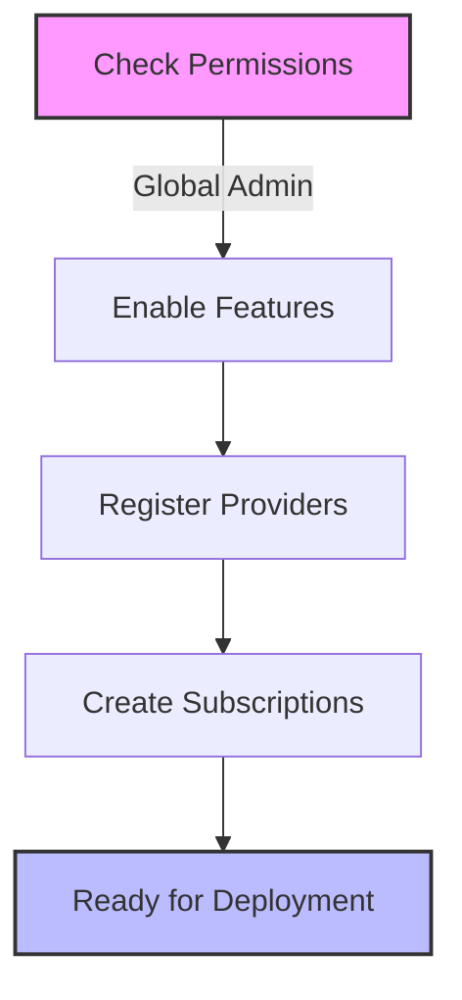

# Prerequisites Checklist

## Required Tools
- [ ] PowerShell 7.4+
- [ ] Azure CLI 2.55.0+
- [ ] Git

## Process Flow

## Azure Environment Setup
- [ ] Global Administrator access
- [ ] Ability to create Management Groups
- [ ] Rights to register Resource Providers
- [ ] Permissions to create Service Principals

## Subscription Requirements
- [ ] Management Subscription
- [ ] Identity Subscription
- [ ] Connectivity Subscription

### Resource Provider Registration
Required providers to be registered:
- [ ] Microsoft.Management
- [ ] Microsoft.OperationalInsights
- [ ] Microsoft.PolicyInsights
- [ ] Microsoft.Security

## Common Gotchas
1. **Permission Propagation**
   - Issue: Role assignments can take up to 30 minutes to propagate
   - Mitigation: Built retry logic into deployment scripts

2. **Global Admin vs Azure RBAC**
   - Issue: Global Admin doesn't automatically have Azure RBAC rights
   - Solution: Explicit elevation to User Access Administrator required

[Setup Instructions →](./implementation/01-initial-setup.md) 