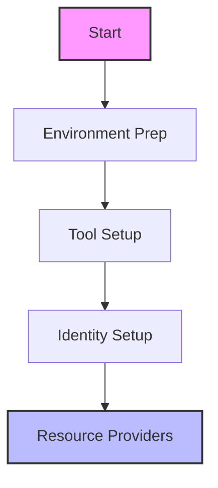

# ALZ Implementation Task Checklist

## Pre-Deployment Tasks
### Environment Preparation
- [ ] [Verify Global Admin access](https://azure.github.io/Azure-Landing-Zones/accelerator/userguide/#prerequisites)
- [ ] Enable Microsoft Entra ID Premium P2 trial
- [ ] [Verify subscription creation rights](https://azure.github.io/Azure-Landing-Zones/accelerator/userguide/#prerequisites)
- [ ] [Check Resource Provider registration permissions](https://azure.github.io/Azure-Landing-Zones/accelerator/userguide/#prerequisites)

### Tool Setup
- [ ] Install/Update PowerShell 7.4+
- [ ] Install/Update Azure CLI 2.55.0+
- [ ] [Configure Git credentials](https://github.com/Azure/ALZ-Bicep/wiki/ConsumerGuide)
- [ ] [Setup Azure DevOps access](https://github.com/Azure/ALZ-Bicep/wiki/PipelinesADO) (if using)

## Initial Setup
### Identity & Access
- [ ] Create break-glass accounts
- [ ] Configure Privileged Identity Management (PIM)
- [ ] Elevate permissions to User Access Administrator
- [ ] Document emergency access process

### Resource Providers
- [ ] Microsoft.Management
- [ ] Microsoft.OperationalInsights
- [ ] Microsoft.PolicyInsights
- [ ] Microsoft.Security

## Core Implementation
### Management Groups
- [ ] [Create root Management Group](https://azure.github.io/Azure-Landing-Zones/accelerator/userguide/#management-group-hierarchy)
- [ ] Create Platform Management Group
- [ ] Create Landing Zones Management Group
- [ ] [Configure Management Group hierarchy](https://azure.github.io/Azure-Landing-Zones/accelerator/userguide/#management-group-hierarchy)

### Subscriptions
- [ ] Create Management subscription
- [ ] Create Identity subscription
- [ ] Create Connectivity subscription
- [ ] Assign subscriptions to Management Groups

### Policy Framework
- [ ] [Review built-in policies](https://github.com/Azure/ALZ-Bicep/wiki/AddingPolicyDefs)
- [ ] [Create custom policy definitions](https://github.com/Azure/ALZ-Bicep/wiki/AddingPolicyDefs)
- [ ] [Create policy initiatives](https://github.com/Azure/ALZ-Bicep/wiki/PolicyDeepDive)
- [ ] [Assign policies to Management Groups](https://github.com/Azure/ALZ-Bicep/wiki/AssigningPolicies)

### Networking
- [ ] [Deploy hub virtual network](https://github.com/Azure/ALZ-Bicep/wiki/DeploymentFlowHS)
- [ ] Configure DNS settings
- [ ] Setup network security groups
- [ ] Configure virtual network peering

## Post-Deployment
### Validation
- [ ] [Verify Management Group structure](https://azure.github.io/Azure-Landing-Zones/accelerator/userguide/#validate-deployment)
- [ ] [Confirm policy assignments](https://azure.github.io/Azure-Landing-Zones/accelerator/userguide/#validate-deployment)
- [ ] Test network connectivity
- [ ] Validate RBAC permissions

### Known Issues & Troubleshooting
- [ ] Review [Known Issues](https://github.com/Azure/ALZ-Bicep/wiki/KnownIssues)
- [ ] Document workarounds implemented
- [ ] Setup monitoring alerts
- [ ] [Configure Azure Monitor baseline](https://github.com/Azure/ALZ-Bicep/wiki/AzureMonitorBaselineAlerts)

### Documentation
- [ ] Update network diagrams
- [ ] Document policy assignments
- [ ] Record configuration decisions
- [ ] Create operational guides

### Cleanup Tasks (Demo Environment)
- [ ] Document resource dependencies
- [ ] Create cleanup script
- [ ] Cancel P2 trial before billing
- [ ] Remove test resources

[Implementation Details →](./implementation/index.md)
[Troubleshooting Guide →](./troubleshooting.md) 