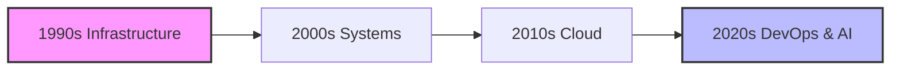

# Technology Journey Timeline

From DOS commands to DevOps pipelines - a journey through the evolution of tech.

## 1990s - The Physical Era
### The DOS Days
Started with DOS 5 and Windows 3.0 on floppies (yes, actual floppy disks). We don't talk about DOS 6, but DOS 6.22 with Windows 3.11? *chef's kiss* - Now that was an OS! 

### Hardware Warriors
- Built PCs from scratch (when RAM was measured in MB)
- Mastered the art of crimping CAT5 cables (thousands of them!)
- Developed superhuman hearing for failing hard drives
- Y2K prep (spoiler alert: we survived!)

### Battle Scars
- That time Windows 95 needed 13 floppy disks to install
- The sweet sound of a successful dial-up connection
- Making network cables until your hands cramped
- The joy of a perfectly cable-tied server rack

## 2000s - The Systems Era
### Server Room Chronicles
- Exchange Server (when email was actually on-premise)
- Active Directory (Group Policy was the new black)
- The virtualization revolution
- Blackberry Enterprise Server (RIP physical keyboards)

## 2010s - The Cloud Revolution
### Azure Adventures
- "What do you mean the server is in the cloud?"
- Exchange Online migration (goodbye server room)
- Learning that 'cattle not pets' isn't about farming
- Infrastructure as Code (because clicking is so 2000s)

## 2020s - The DevOps & AI Era
### Current Playground
- Azure Landing Zones (because enterprise needs guardrails)
- DevOps (git push and pray)
- Infrastructure as Code (Bicep > ARM, fight me)
- AI integration (yes, ChatGPT, you can help with PowerShell)

## The Journey Continues...
From troubleshooting IRQ conflicts to debugging YAML pipelines - the tools change, but the thrill of solving problems remains the same.

[Back to Overview →](./alz/overview.md) 